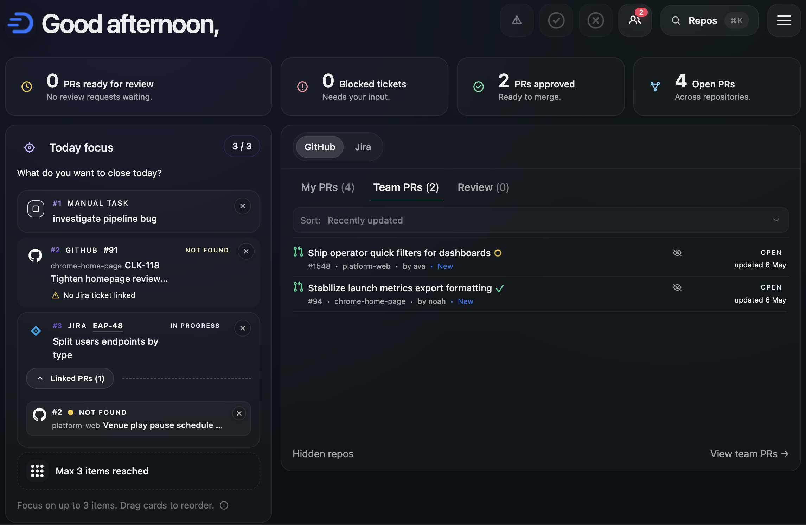

# Donezo

<p align="center">
  
</p>

Donezo is a Chrome new tab extension for day-to-day engineering work. It replaces the default new tab page with a dashboard that combines GitHub, Jira, Today focus, and local notes into one workspace.

<p align="center">
  
</p>

The app is built with React, TypeScript, Vite, and Tailwind CSS. It is currently optimized for a personal workflow, but the codebase is structured around configurable local settings for GitHub and Jira.

## Overview

When the extension is loaded in Chrome, opening a new tab shows a dashboard with:

- a dashboard header and integration switcher
- a GitHub workspace card for your PRs, team PRs, and review requests
- a Jira workspace card for active assigned issues
- a Today focus board for the top items you want to close today
- a notes card for quick local capture
- a settings page for profile, GitHub, and Jira configuration

## Core Features

### GitHub dashboard

The GitHub side of the dashboard includes:

- your open pull requests
- recent team pull requests
- pull requests requesting your review
- review status, CI status, merge state, and draft state signals
- status filters such as approved, ready to merge, and waiting review
- owner or organization scoping through Settings

The dashboard fetches GitHub data through the extension background service worker rather than calling GitHub directly from the React UI.

### Jira dashboard

The Jira side of the dashboard includes:

- active assigned issues
- in-progress issue counts
- blocking issue counts
- high-priority issue counts
- links back to Jira

The default Jira query used by the app is:

```text
assignee = currentUser() AND statusCategory != Done ORDER BY priority DESC, updated DESC
```

### Today focus

Today focus is a small planning board for the day.

It supports:

- dragging Jira issues into Today focus
- dragging GitHub pull requests into Today focus
- nesting GitHub pull requests under Jira items
- reordering top-level items and nested pull requests
- a limit of 3 top-level focus items
- manual tasks with a preview-first details view and explicit edit flow

It also has some useful automation:

- when you add a Jira ticket, GitHub pull requests with the same Jira key in the PR title are linked automatically
- standalone GitHub pull requests with the same Jira key can be grouped under the related Jira item
- Jira-backed focus items stay synced with fresh Jira title and status data
- GitHub-backed focus items stay synced with fresh PR title, URL, and review status data
- if a focus item is no longer present in the main dashboard payload, fallback lookups try to refresh Jira issue details and GitHub PR terminal states

Manual tasks support:

- creating standalone focus tasks
- Markdown notes with headings, lists, checkboxes, links, inline code, and fenced code blocks
- clickable checklist toggles inside the manual-task preview
- a preview mode before edit mode
- completion state directly on the Today focus card
- chrome-storage persistence for task content and ordering

### GitHub warning state and favicon state

Donezo still surfaces pull request warning activity through dashboard signals and browser chrome:

The favicon changes when the dashboard detects:

- failed build attention
- warning attention
- new comment attention
- ready-to-merge attention

The document title also shows the active attention count when one of those states is present.

### Owner filtering

GitHub data can be scoped to a specific owner or organization from Settings.

Behavior:

- the owner list is loaded from GitHub when you open the dropdown
- leaving it on `All` keeps the combined view
- the selected owner filter affects dashboard data and repository search indexing

### Repository search

Donezo includes a repository launcher for fast GitHub navigation.

Features:

- open from the dashboard header
- keyboard shortcut: `Cmd+K` or `Ctrl+K`
- ranked search across indexed repositories
- owner-aware repository indexing
- keyboard navigation with arrow keys and `Enter`
- ability to hide repositories from search results
- hidden repositories can be restored from Settings

## How It Works

The app has two runtime layers:

1. The React UI in `src/`
2. A Chrome extension background service worker in [public/background.js](/Users/xtian/dev/donezo/public/background.js)

The React app does not perform the main GitHub and Jira API requests directly. Instead it sends messages through `chrome.runtime.sendMessage(...)` to the background service worker, and the background worker performs the API calls and caching.

This matters because:

- full GitHub and Jira integration only works in the extension runtime
- plain Vite dev mode is still useful for UI work and local behavior, but the Chrome message bridge is not fully available there

## Integrations

### GitHub

The GitHub integration uses:

- REST API calls for connection checks and pull-request-related signals
- GraphQL API calls for pull request search and metadata

The dashboard currently fetches:

- PRs authored by you
- recent team pull requests
- PRs requesting your review
- review decision state
- merge state
- CI and check state
- repository search index data

GitHub data is cached and refreshed through the background worker. The app also watches for dashboard cache changes and foreground visibility changes so the UI stays in sync.

### Jira

The Jira integration uses Atlassian REST APIs with:

- Jira base URL
- Atlassian account email
- Jira API token

The dashboard derives:

- active issue counts
- in-progress counts
- blocking issue relationships
- high-priority issue subsets
- Jira browse links

Jira data is also cached and refreshed through the background worker and UI refresh flow.

## Settings

The Settings page manages:

- display name
- GitHub username
- GitHub personal access token
- dashboard owner or org filter
- hidden repositories restore list
- Jira base URL
- Jira email
- Jira API token
- GitHub dev mode toggle

Connection testing is built into the Settings page for both GitHub and Jira.

## Storage

Settings and dashboard-local state are stored locally.

Depending on runtime, the app uses:

- `chrome.storage.local` inside the extension
- `localStorage` fallback for local browser UI usage

Stored data includes:

- profile name
- GitHub settings
- Jira settings
- notes
- Today focus items
- active dashboard view state
- GitHub attention state
- hidden repositories
- cached GitHub and Jira dashboard data

## GitHub Token Setup

The app expects a GitHub personal access token.

The Settings page currently documents these scopes:

- `repo`
- `notifications`
- `read:user`
- `read:org`

You should also enter:

- your GitHub username
- an optional default owner or org filter

## Jira Token Setup

The Jira integration expects:

- your Jira site URL, for example `https://your-company.atlassian.net`
- your Atlassian account email
- an Atlassian API token

Typical setup flow:

1. Create an Atlassian API token.
2. Use your Jira email address.
3. Use the API token rather than your Atlassian password.
4. Save the values in Settings.
5. Test the connection from the Settings page.

## Development

### Prerequisites

- Node.js
- npm
- Google Chrome

### Install dependencies

```bash
npm install
```

### Build the extension in dev mode

```bash
npm run dev
```

This watches the source files and writes a development build to `dist/`. Load the
`dist/` folder in Chrome to use the extension runtime with development-only
mock data controls enabled.

### Run the Vite dev server

```bash
npm run dev:server
```

Important limitation:

- this runs the React app in normal browser dev mode
- the Chrome extension background runtime is not active there
- GitHub and Jira flows that depend on `chrome.runtime.sendMessage(...)` will not fully work

Vite dev mode is mainly useful for:

- layout and styling work
- component development
- non-extension local state behavior

### Build the extension

```bash
npm run build
```

This outputs the packaged extension to `dist/`.

### Run the test suite

```bash
npm test
```

Use `npm run test:watch` while developing. Pull requests and pushes to `main`
also run the type-check, unit tests, and production build in GitHub Actions.

### Preview the built app

```bash
npm run preview
```

### Load the extension in Chrome

After building:

1. Open `chrome://extensions`
2. Enable Developer mode
3. Click `Load unpacked`
4. Select the `dist/` folder

Once loaded, opening a new Chrome tab should show Donezo instead of the default new tab page.

If you make code changes:

1. Re-run `npm run build`
2. Reload the extension in `chrome://extensions`

## Dev Mode And Mock Data

The dashboard supports a stored GitHub dev mode for mock scenarios.

How it works:

- GitHub dev mode is enabled from the Settings page
- once enabled, dev mode is stored locally
- the active mock scenario is selected from the header menu
- the Settings page includes an `Enable dev mode` toggle

Notes:

- scenario selection still happens in the UI
- clearing dev mode returns the dashboard to live GitHub data

## Project Structure

Key files and modules:

- [src/App.tsx](/Users/xtian/dev/donezo/src/App.tsx): app bootstrapping, routing, settings loading, and dashboard composition
- [src/pages/DashboardPage.tsx](/Users/xtian/dev/donezo/src/pages/DashboardPage.tsx): main dashboard composition
- [src/pages/SettingsPage.tsx](/Users/xtian/dev/donezo/src/pages/SettingsPage.tsx): settings and connection management
- [src/components/GitHubCard.tsx](/Users/xtian/dev/donezo/src/components/GitHubCard.tsx): GitHub dashboard UI
- [src/components/JiraCard.tsx](/Users/xtian/dev/donezo/src/components/JiraCard.tsx): Jira dashboard UI
- [src/components/SummaryCard.tsx](/Users/xtian/dev/donezo/src/components/SummaryCard.tsx): Today focus board UI and manual-task preview/editor flow
- [src/components/GitHubRepoLauncher.tsx](/Users/xtian/dev/donezo/src/components/GitHubRepoLauncher.tsx): repository search launcher UI
- [src/hooks/useGitHubDashboard.ts](/Users/xtian/dev/donezo/src/hooks/useGitHubDashboard.ts): GitHub dashboard loading and refresh behavior
- [src/hooks/useJiraDashboard.ts](/Users/xtian/dev/donezo/src/hooks/useJiraDashboard.ts): Jira dashboard loading and refresh behavior
- [src/hooks/useTodayFocusState.ts](/Users/xtian/dev/donezo/src/hooks/useTodayFocusState.ts): Today focus state and mutations
- [src/hooks/useTodayFocusFallbacks.ts](/Users/xtian/dev/donezo/src/hooks/useTodayFocusFallbacks.ts): focused fallback refresh logic for Today focus items
- [src/hooks/useFaviconState.ts](/Users/xtian/dev/donezo/src/hooks/useFaviconState.ts): favicon and title warning state
- [src/lib/githubApi.ts](/Users/xtian/dev/donezo/src/lib/githubApi.ts): UI-side GitHub bridge helpers
- [src/lib/jiraApi.ts](/Users/xtian/dev/donezo/src/lib/jiraApi.ts): UI-side Jira bridge helpers
- [src/lib/githubDomain.ts](/Users/xtian/dev/donezo/src/lib/githubDomain.ts): GitHub domain rules
- [src/lib/githubCardDomain.ts](/Users/xtian/dev/donezo/src/lib/githubCardDomain.ts): GitHub card list shaping and summary helpers
- [src/lib/jiraDomain.ts](/Users/xtian/dev/donezo/src/lib/jiraDomain.ts): Jira domain rules
- [src/lib/todayFocusSync.ts](/Users/xtian/dev/donezo/src/lib/todayFocusSync.ts): Today focus reconciliation logic
- [src/lib/focusMapping.ts](/Users/xtian/dev/donezo/src/lib/focusMapping.ts): Jira and PR to focus-item mapping
- [src/lib/githubRepoSearchDomain.ts](/Users/xtian/dev/donezo/src/lib/githubRepoSearchDomain.ts): repository ranking and search scoring
- [src/lib/storage/](/Users/xtian/dev/donezo/src/lib/storage): storage modules for settings, notes, focus items, preferences, and defaults
- [public/background.js](/Users/xtian/dev/donezo/public/background.js): Chrome extension background worker and external API access
- [public/manifest.json](/Users/xtian/dev/donezo/public/manifest.json): Chrome extension manifest

## Scripts

- `npm run dev` - watch and build the extension into `dist/` with development-only controls
- `npm run dev:server` - run the Vite development server
- `npm run build` - type-check and build the extension into `dist/`
- `npm run typecheck` - type-check the TypeScript source
- `npm test` - run the unit test suite once
- `npm run test:watch` - run the unit test suite in watch mode
- `npm run preview` - preview the built Vite app locally

## Current Limitations

- the app is primarily shaped around one personal workflow
- full GitHub and Jira behavior depends on the extension runtime
- automated coverage currently focuses on pure domain modules; hooks,
  components, and the background worker are not covered yet

## Extension Permissions

The extension currently requests:

- `storage`
- `alarms`
- host access to `https://api.github.com/*`
- host access to `https://*.atlassian.net/*`
